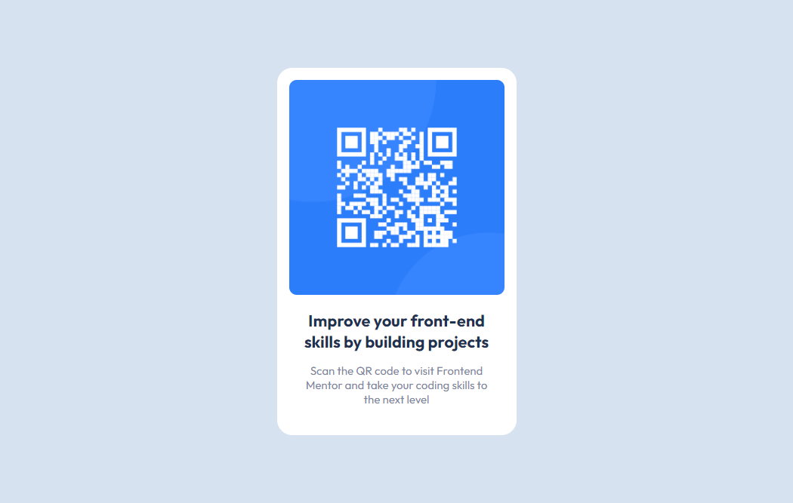

# QR Code challenge

> Desafio do site Frontend Mentor

Nesse projeto simples eu repliquei o mais próximo possível o resultado final do Qr code do site Frontend mentor! Eu fiz com base em algumas informações que o site nos fornece, como font-family, imagens e cores por exemplo. Gostei muito do resultado!

[🔗 Clique aqui para acessar](https://filipesantos07.github.io/Desafio-qr-code/)

## 🛠️ Tecnologias

- HTML
- CSS

## 💛 Contato

outerspaceguy@live.co.uk
